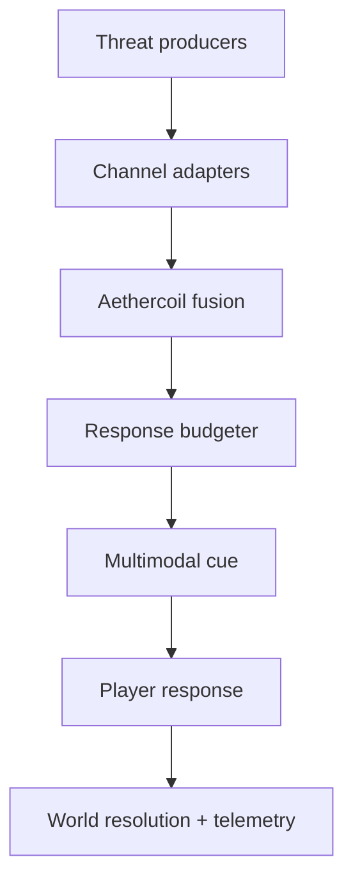

# RFC: Serpentine Sense — Aethercoil Awareness System

Status: experimental vertical slice  
Target: Reincarne Logic iOS prototype first; engine-agnostic core afterward  
Working name: **Serpentine Sense**  
Subsystem codename: **Aethercoil**

## 1. Intent

Serpentine Sense is an environmental-awareness superpower for Afro-Gorgon,
cybernetic, magical-energy-wielding entities. It is inspired by the design
problem solved by "danger sense" mechanics, but it is not a renamed spider
ability.

The fantasy is not merely "danger is near." A Gorgon experiences the world as
overlapping pressure fields: muscle intent, aura turbulence, spell causality,
machine prediction, ancestral resonance, and the mineral memory of structures.
The player should feel a living crown of serpents thinking around them while
their aetherware turns instinct into a short, actionable glimpse of what may
happen next.

The system must:

- warn without becoming an omniscient autopilot;
- create choices instead of one prescribed QTE button;
- work on systemic threats, not only authored set pieces;
- preserve a distinct Gorgon identity built around coils, gaze, thresholds,
  aura, stone, and distributed perception;
- combine biological, magical, and cybernetic sensing without treating them as
  interchangeable skins;
- remain accessible when audio, haptics, motion, or color cannot be used.

"Afro-Gorgon" is treated here as an original Afrofuturist identity, not a
generic collage of African cultures. Production art and narrative should name
the character's specific lineage, region, community, and visual references
before incorporating real-world sacred or ceremonial symbols.

## 2. Human factors baseline

Simple reaction time and choice reaction time are different design budgets.
A player can react quickly to one expected cue, but identifying a threat,
choosing a response, aiming, and executing it is a choice task. The mechanic
therefore uses multimodal cues for fast orientation and controlled time dilation
for deliberation.

Do not treat any single reaction-time number as universal. Display latency,
input hardware, age, ability, fatigue, cue compatibility, and the number of
choices all change the result. A comparative laboratory study found auditory
responses faster than visual responses in its task, while the Deary-Liewald
work provides a reproducible distinction between simple and four-choice
reaction tasks:

- [Comparative visual and auditory reaction-time study](https://pmc.ncbi.nlm.nih.gov/articles/PMC4456887/)
- [The Deary-Liewald reaction-time task](https://pubmed.ncbi.nlm.nih.gov/21287123/)

Apple's Core Haptics supports coordinated haptic and audio events, making it a
good fit for the iOS vertical slice:

- [Core Haptics documentation](https://developer.apple.com/documentation/corehaptics)
- [Expanding the Sensory Experience with Core Haptics](https://developer.apple.com/videos/play/wwdc2019/223/)

Initial tuning targets are hypotheses to test, not biological laws:

| Budget | Starting target |
|---|---:|
| Cue recognition | 170 ms |
| Input/motor allowance | 80 ms |
| Usable choice window | 900 ms |
| Minimum world time scale | 0.10× |
| Maximum assisted real-time window | 2.25 s |

## 3. Power identity: four sensing channels

Each channel contributes a different kind of evidence. Threats may activate
more than one channel, but one channel normally dominates the cue.

| Channel | Origin | What it perceives | Player cue language |
|---|---|---|---|
| **Coil Instinct** | Serpentine biology | Motion, pressure, breath, muscle intent | Tight directional haptic snap |
| **Aura Sight** | Personal magical field | Hostility, fear, life-force distortion | Colored corona plus heartbeat bloom |
| **Aetherware Oracle** | Cybernetic prediction | Trajectories, networks, machine behavior | Braided circuit line and precise tone |
| **Hex Echo** | Sorcery/causal sensitivity | Curses, delayed spells, broken oaths | Reversed chime and glyph fracture |

These channels create useful disagreement. Aetherware may predict that a beam
will miss while Aura Sight senses the attacker's intent to redirect it. Hex Echo
may detect a curse that has no physical trajectory. Coil Instinct may be the
only channel still trustworthy inside an anti-magic field.

## 4. Threat families and response verbs

The prototype uses five threat families and five response verbs. The full game
should allow several valid responses based on build, position, allies, and
available energy.

| Threat family | Example | Strong default response |
|---|---|---|
| Kinetic fracture | Debris, projectile, collapsing floor | **Flow** — evade or redirect momentum |
| Aura predation | Hostile will, possession, panic cascade | **Gaze** — expose and lock hostile intent |
| Hex weave | Curse, delayed ritual, probability snare | **Sever** — cut the causal strand |
| Aether surge | Unstable magic, portal shear, overload | **Ward** — ground or absorb the field |
| Cyber intrusion | Drone swarm, implant spoof, hostile mesh | **Rewrite** — counter-command the system |

The verbs are deliberately broader than "dodge." That keeps the system from
collapsing into a reskinned QTE.

## 5. Interaction loop

1. **Whisper** — one or more channels notice an anomaly. The player receives a
   subtle directional cue but combat does not slow yet.
2. **Constriction** — confidence and severity cross the assistance threshold.
   A synchronized haptic/audio cue declares direction and channel.
3. **Crown Flare** — Aethercoil computes only as much time dilation as the
   current lead time and player accessibility profile require.
4. **Orient** — the player selects the source direction. Camera assistance may
   bias toward it, but never forces a snap during manual aiming.
5. **Channel** — the player chooses Flow, Gaze, Sever, Ward, Rewrite, or a
   character-specific ability.
6. **Afterimage** — world time returns quickly, the resolution executes, and
   Aethercoil reserve/strain updates.

Ignoring the cue remains a valid decision. A player may accept damage to finish
a boss phase, preserve reserve for a civilian rescue, or trust an ally to
respond.

## 6. Balance model

Let:

- `L` be predicted lead time in world seconds;
- `B` be the requested usable decision budget in real seconds;
- `C` be cue-recognition latency in real seconds;
- `I` be input/motor allowance in real seconds;
- `s` be world time scale, where `1.0` is normal time and `0.1` is 10% speed.

The requested scale is:

```text
s_requested = clamp(L / (B + C + I), s_min, 1)
```

The real time available before impact is `L / s`. The usable response window is:

```text
usable_real_seconds = (L / s) - C - I
```

Time dilation must not fully trust a weak forecast. Let `q` be forecast
confidence, `v` be severity, and `w` be a smooth confidence weight between the
minimum and full-confidence thresholds:

```text
assist_weight = smoothstep(q_min, q_full, q) * v
s_effective = 1 - (1 - s_requested) * assist_weight
```

This blends uncertain or trivial events toward normal time. It prevents a noisy
sensor from repeatedly freezing the game.

Aethercoil reserve limits assistance:

```text
reserve_cost = k * (1 - s_effective) * (L / s_effective) * (0.5 + 0.5v)
```

If the player lacks reserve, assistance is proportionally reduced rather than
silently granted. Reserve regenerates only outside Crown Flare. Severe failures
can add **Crown Static**, temporarily lowering confidence and creating a real
risk/reward arc.

### Recommended starting bands

| Situation | Lead time | Confidence | Expected behavior |
|---|---:|---:|---|
| Readable projectile | 1.2–2.0 s | 0.85–1.0 | Little or no dilation |
| Chaotic debris | 0.45–1.0 s | 0.65–0.9 | Moderate dilation |
| Point-blank strike | 0.15–0.4 s | 0.9–1.0 | Heavy dilation, high reserve cost |
| Ambiguous omen | Any | <0.45 | Whisper only; no forced slowdown |

If even `s_min` cannot create the accessibility target, the event is
mechanically unavoidable. Designers must then either provide an earlier
forecast, allow an expensive automatic defense, or label the event as damage
pressure rather than a reaction challenge.

## 7. System architecture



### Threat producers

- Physics predicts trajectories and structural intersections.
- Combat AI exposes intent windows, not private final decisions.
- Spell systems publish cast, delayed-effect, curse, and causal-chain events.
- Aura systems publish hostility and field-distortion gradients.
- Network/cyber systems publish intrusion and command-conflict events.

### Channel adapters

Every producer emits a common `ThreatSignature`:

```text
id, family, source, target, direction, lead_time,
severity, confidence, ambiguity, dominant_channel,
valid_responses, accessibility_priority
```

### Fusion

Fusion deduplicates events, combines independent evidence, and preserves
disagreement. It should be deterministic first. Physical trajectories belong
on CPU physics tasks or general GPU compute when scale demands it; Tensor Cores
are relevant only if a trained inference model is actually part of the design.

### Scheduling

- High-confidence imminent threats update every simulation tick.
- Distant/low-severity threats update at a reduced cadence.
- Prediction runs against immutable snapshots to avoid racing live world state.
- Results carry a source-frame/version identifier and are discarded when stale.
- A fixed per-frame budget prevents awareness work from stealing the render
  frame.

## 8. Prototype behavior

The iOS vertical slice simulates this loop:

- a threat appears in one of eight directions;
- the engine evaluates lead time, severity, confidence, and ambiguity;
- world countdown advances at the computed time scale;
- the interface fires a directional stereo cue plus haptic pulse;
- the player identifies direction and selects a response verb;
- correct choices build score and Coil Streak;
- time dilation consumes Aethercoil reserve;
- low-confidence threats receive weaker assistance.

The Python simulator mirrors the same equations so tuning can happen without
launching Xcode.

```bash
python3 simulation/serpentine_sense_balance.py
python3 -m unittest simulation/test_serpentine_sense_balance.py
```

## 9. Accessibility contract

- Never encode direction or threat family by color alone.
- Provide independent visual, audio, and haptic cue toggles.
- Offer a configurable target decision window and minimum time scale.
- Support reduced motion; camera assistance cannot require rapid camera motion.
- Allow hold, toggle, and auto-orient control modes.
- Expose cue intensity without tying mechanical difficulty to physical output
  strength.
- Record timing telemetry only with consent and avoid inferring medical or
  cognitive conditions from player performance.

## 10. Telemetry for tuning

Collect aggregate, privacy-respecting events:

- prediction lead time and confidence;
- time scale and reserve cost;
- cue-to-orient time;
- orient-to-response time;
- chosen response and valid response set;
- success, ignore, late response, or wrong interpretation;
- number of overlapping threats;
- accessibility preset, only when the player opts into telemetry.

The core balance question is not "did the player press fast enough?" It is:
"did the cue give the player enough information and time to make an intentional
Gorgon decision?"

## 11. Acceptance criteria for the skeleton

- Serpentine Sense is reachable as its own tab in the existing iOS prototype.
- Threats originate from eight directions and five distinct families.
- Direction and response are separate choices.
- Time scale is derived from lead time, player budget, confidence, severity,
  and available reserve.
- A low-confidence event cannot trigger maximum slowdown.
- The same balance invariants are covered by deterministic Python tests.
- The design remains functional with any one cue modality disabled.
- No code claims to use ML-specific hardware when it is performing ordinary
  physics or deterministic scoring.

## 12. Next-stage expansion

1. Add real Core Haptics patterns per channel rather than generic impact
   generators.
2. Calibrate stereo/spatial cues on device and measure end-to-end latency.
3. Add overlapping threats and let the player braid responses into one action.
4. Port `ThreatSignature` and the budgeter into an Unreal subsystem with
   Gameplay Tags, Mass/async task producers, and deterministic replay tests.
5. Give individual Afro-Gorgon lineages different channel weights and response
   vocabularies after their cultural and narrative foundations are defined.
6. Prototype Crown Static, false omens, ally warnings, and voluntary cue ignore.

